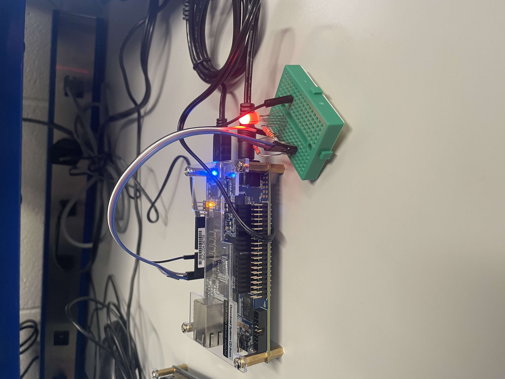

# Homework 10: RGB LED Controller VHDL

## Overview
For homework 10, a VHDL component was created to control an RGB LED through period and duty cycle inputs. The component instantiated three PWM controller components that were created in HW 9, and established registers for the duty cycles of each LED and a register for the period. These registers were written to in system console to control the color of an RGB LED. Calculating the current limitting resistors for each diode was completed as well.

## Deliverables

