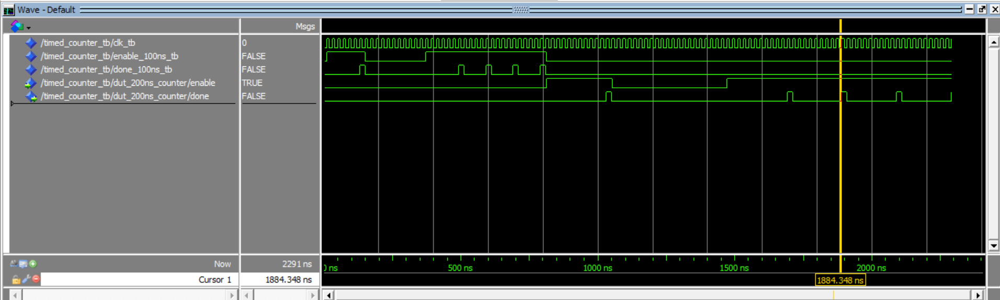
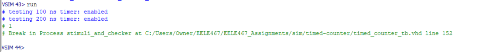

# Homework 4: Timed Counter VHDL
## Overview
Homework 4 consisted of creating a counter component that would assert a logic high after a user specified period of time. A test bench was also created to test the functionality of the timer in a few different ways. This assignment helped me brush up on VHDL syntax that I had forgotten and taught me the basics of creating a test bench.

## Deliverables

