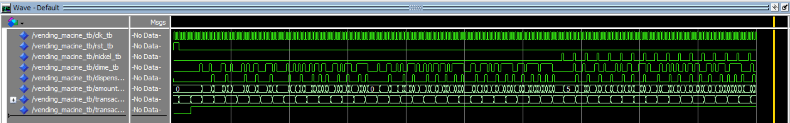
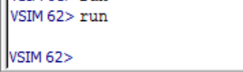

# Homework 5: Vending Machine VHDL

## Overview
Homework 5 consisted of creating a state machine in VHDL to model the functionality of a vending machine. I used a Moore machine to model the functionality and tested it with the provided test bench.

## Deliverables

