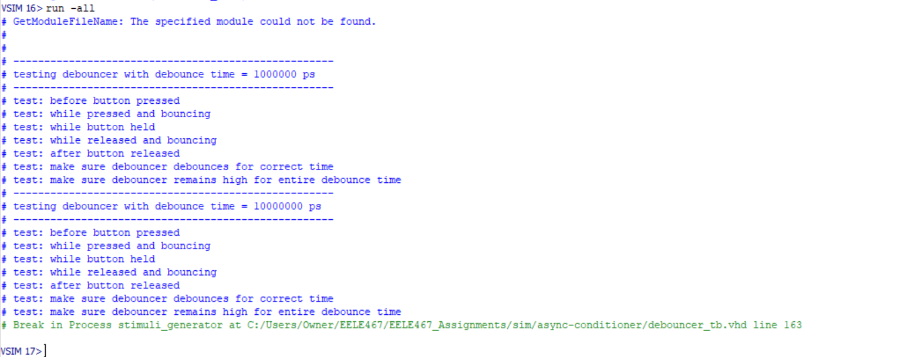
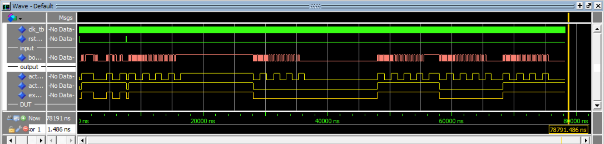
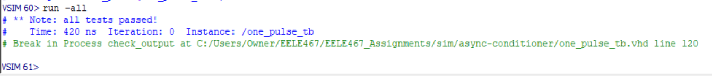
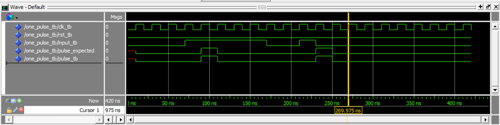
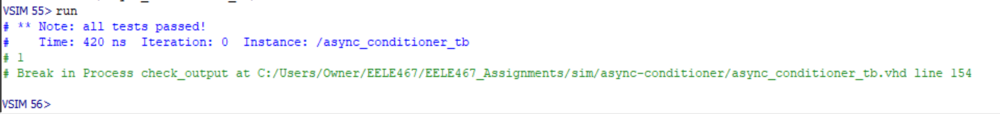
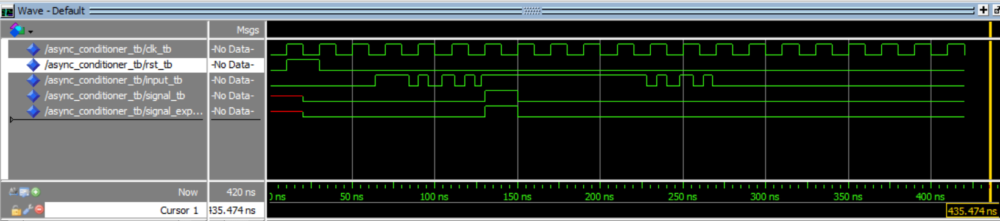

# Homework 6: Async Conditioner

## Overview
For homework 6, a conditioner for asynchronous signals was created. The conditioner consists of a synchronizer, debouncer, and single-pulse generator. Each component was created separately at first, then combined at the end to make a single conditioner component with all three aspects. Test benches for each component were created as well.

## Deliverables
### Debouncer

### One Pulse

### Async Conditioner

