# Homework 7: Linux CLI Practice

## Overview
This assignment provided practice with Linux CLI tools that will be useful in upcoming assignments.

## Deliverables

### Problem 1
`$wc -w lorem-ipsum.txt`
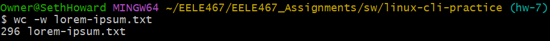

### Problem 2
`$wc -m lorem-ipsum.txt`
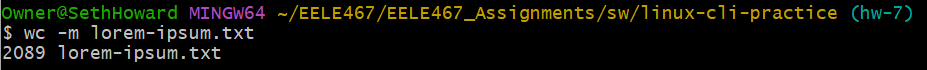

### Problem 3
`$wc -l lorem-ipsum.txt`
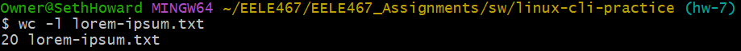

### Problem 4
`$sort -h file-sizes.txt`

The output of this one had a LOT of stuff. The output ended with 72G
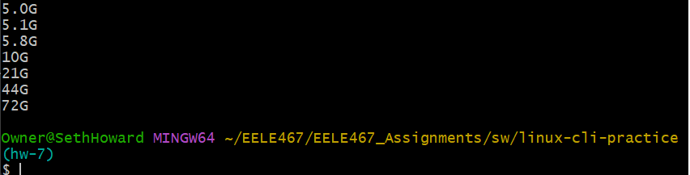

### Problem 5
`$sort -h -r file-sizes.txt`

The output of this one also had a LOT of stuff. The output ended with 0.
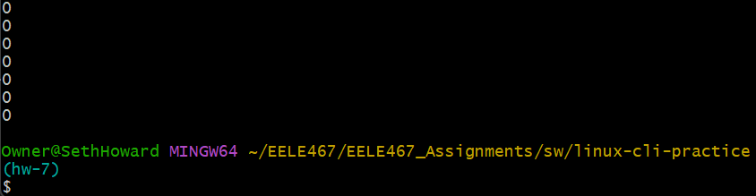

### Problem 6
`$cut -d ',' -f 3 log.csv`
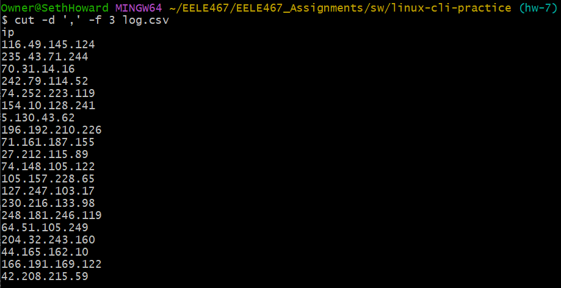

### Problem 7
`$cut -d ',' -f 2,3 log.csv`
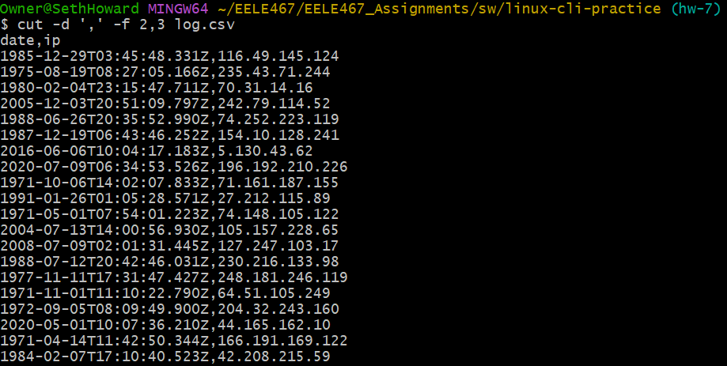

### Problem 8
`$cut -d ',' -f 1,4 log.csv`
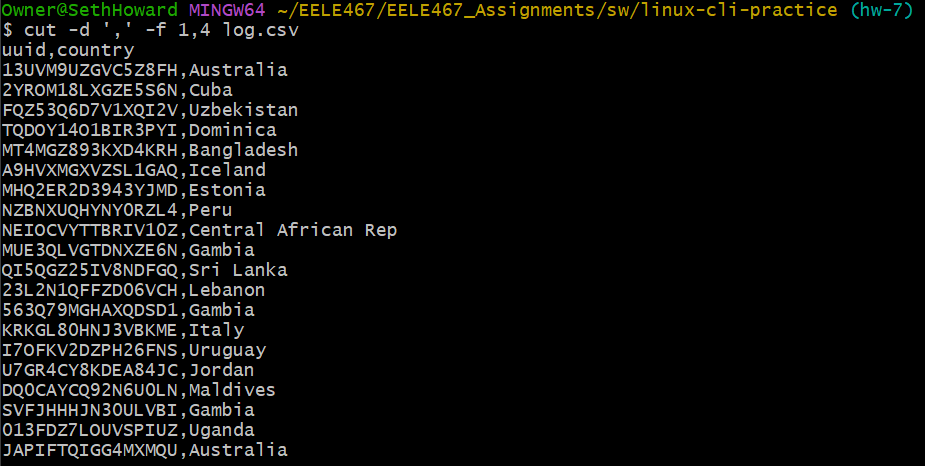

### Problem 9
`$head -n 3 gibberish.txt`
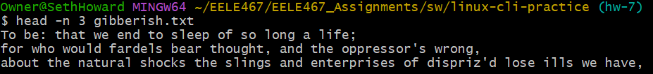

### Problem 10
`$tail -n 2 gibberish.txt`
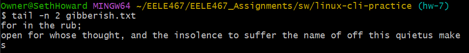

### Problem 11
`$tail -n +2 log.csv`
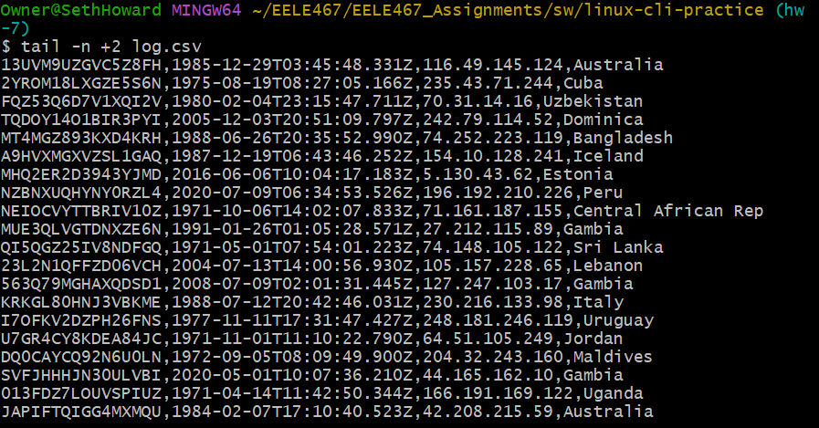

### Problem 12
`$grep -w and gibberish.txt`
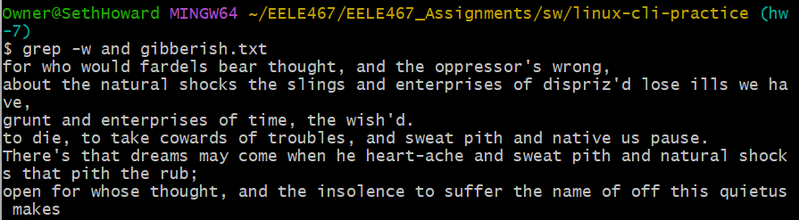

### Problem 13
`$grep -w we -n gibberish.txt`
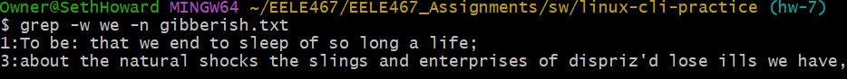

### Problem 14
`$grep -o -P 'to [a-z]+' -i gibberish.txt`
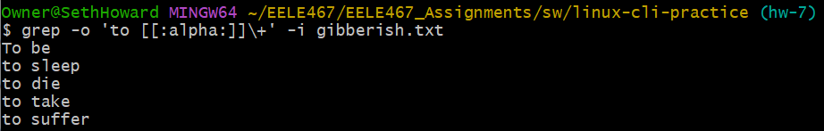

### Problem 15
`$grep -c fpgas -i fpgas.txt`
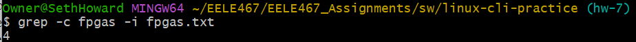

### Problem 16
`$grep -P '\b\w*(ot|er|ile)\b' fpgas.txt`
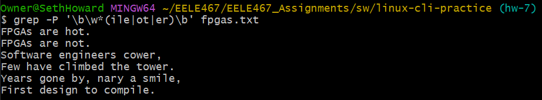

### Problem 17
`$grep -c "^\s--" -r ../../hdl/*/*.vhd`
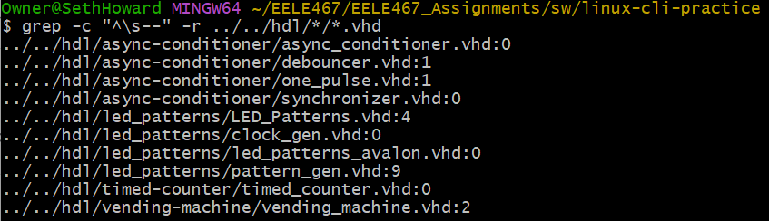

### Problem 18
`$ls > ls-output.txt`
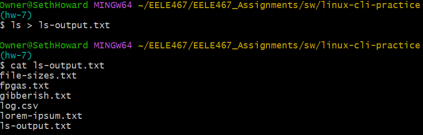

### Problem 19
`$sudo dmesg | grep "CPU topo"`
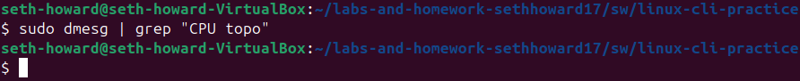

### Problem 20
`$find ../../hdl/* -iname '*.hdl' | wc -w`
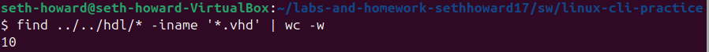

### Problem 21
`$grep -r "[--]" ../../hdl/*/*.vhd | wc -l`
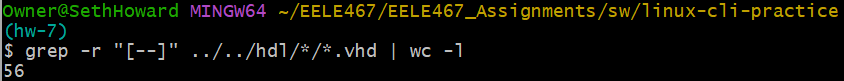

### Problem 22
`$grep -n FPGAs -i fpgas.txt | cut -d ':' -f 1`
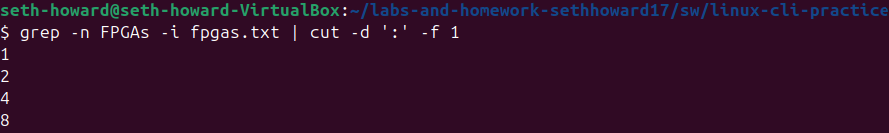

### Problem 23
`$du -h * | sort -h | tail -n 3`
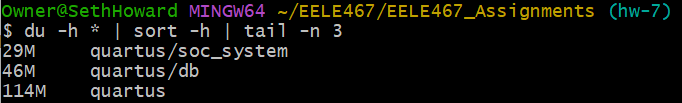
