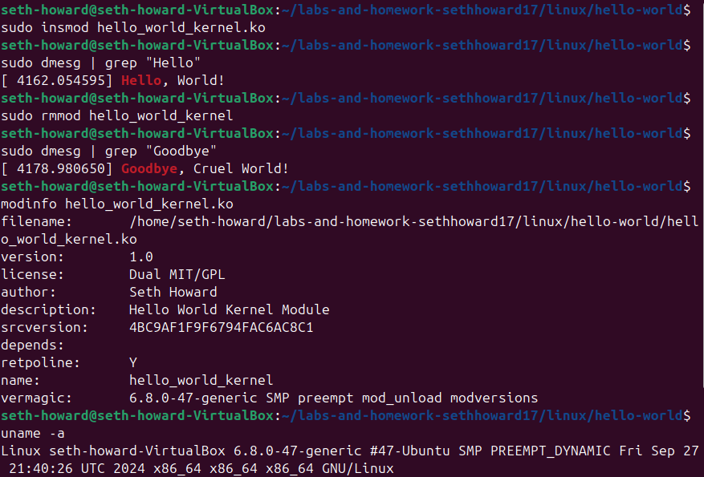
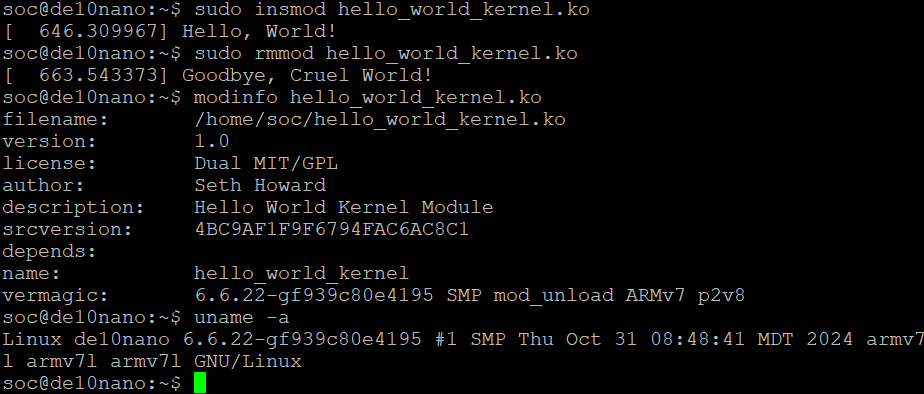

# Homework 8: "Hello World" Linux Kernel Module

## Overview
For homework 8, a Makefile and a linux kernel module were created to get practice with cross-compiling and running a kernel on the FPGA. When loading the kernel, a "hello world" message was printed and when unloading the kernel, a "goodbye world" message was printed. This was tested in both the Ubuntu VM and in PuTTY on the FPGA.

## Deliverables

