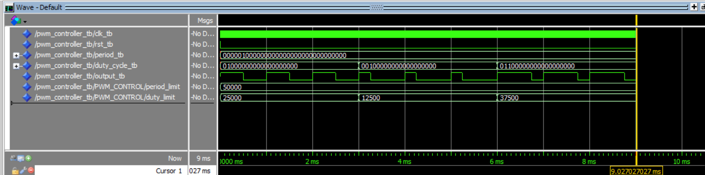
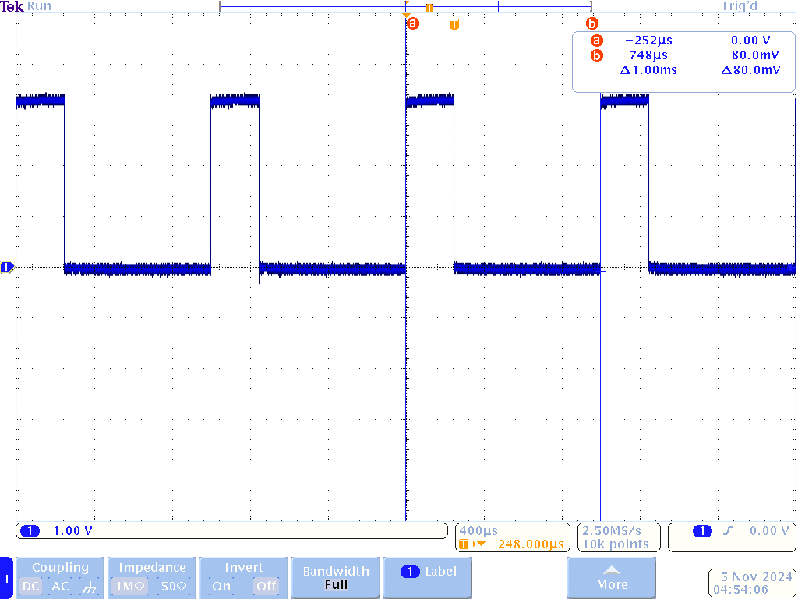
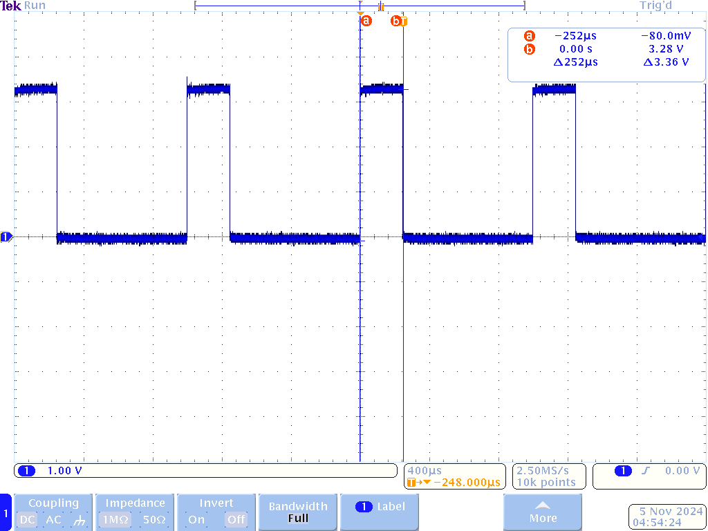

# Homework 9: PWM Controller VHDL

## Overview
For homework 9, a VHDL component was created to control a PWM signal with user inputs for the period and duty cycle. A testbench was created and the component was tested in ModelSim, then the component was instantiated in Quartus and uploaded to the FPGA. Here, an oscilloscope was used to measure the output of the PWM controller on one of the GPIO pins.

## Deliverables
The testbench was created to show three different duty cycle inputs on a constant 1 ms period. The simulation waveform shows a 50% duty cycle followed by a 25% duty cycle and finally a 75% duty cycle.

When instantiating the component in the top level file, the period was hard coded to 1 ms and the duty cycle was hard coded to 25%. The following images show the oscilloscope waveform with the cursors measuring the period and the duty cycle.

