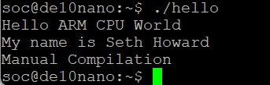

# Lab 3: Developer's Setup

## Overview
For Lab 3, the functionality to boot the DE100-Nano from the Ubuuntu VM was established. With this set up, files can be created and debugged in Ubuntu and immediately be available for execution on the FPGA, as long as an ethernet connection is established.

## Deliverables

