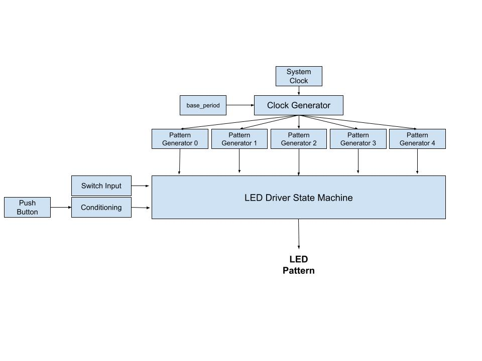

# Lab 4 Report

## Project Overview
For lab 4, a system to drive various patterns on the LEDs of the DE10 Nano was created. This lab focused on driving the LEDs via hardware by establishing clock and pattern generators in VHDL. Through the use of a state machine, the pattern displayed on the LEDs and the rate at which the pattern moved was controlled by the switches and push buttons on the FPGA. 
### Functional Requirement 1
LED #7 was always blinking at the base rate specified by the user. This held true no matter which state the system was in.
### Functional Requirement 2
In State 0 (Switches = "0000"), one LED shifted to the right twice as fast as base LED #7. In State 1 (Switches = "0001), two LEDs shifted to the left together four times as fast as base LED #7. In State 2 (Switches = "0010"), the LEDs displayed a 7-bit binary up counter moving half as fast as base LED #7. In State 3 (Switches = "0011"), the LEDs displayed a 7-bit down counter moving eight times as fast as base LED #7. In State 4 (Switches = "0100"), the LEDs displayed a user defined pattern, which I chose to be a fountain-like pattern, twice as fast as base LED #7. More information about this user defined pattern can be found in the Implementation Details section of the report.
### Functional Requirement 3
A sequence took place on the push of one of the buttons on the FPGA. The sequence began by displaying the state of the switches on the LEDs for one second. After this period, the binary code of the switches established which pattern was shown. The pattern belonging with each state of the switches was described above in requirement 2. If the switches represented a value above "0100", which did not correspond to a pattern, the previous pattern was shown. The pattern was held until the switches were changed and the push button was pressed again.

## System Architecture

A diagram of the system architecture can be seen in Figure 1 below. The system clock was fed into a clock generator component that created 5 new clocks. The first clock was set based on an input from the user that specified the base period of the system. The other four clocks were multiples or divisions of this base clock. Each clock was fed into the pattern generator associated with it and the output of the pattern generators was fed into the state machine. The switches and the push button signal were fed into the state machine as well and all of these systems together made up the LED_Patterns component.

Figure 1: Block Diagram of System Architecture

A diagram of the state machine structure that was used to drive the proper LED patterns to the LEDs is shown in Figure 2. State 0 served as the default state when the system was initialized as well as when the system was reset. The system would sit in a state until the push button was pressed, which would move the system to the DisplaySW state. Here, the binary value corresponding to the position of the switches was displayed on the LEDs for one second. The system would then move to the state associated with the value given by the switches. There were only 5 states, so if the switches represented a value greater than "0100", the system would return to whatever LED pattern state it was previously in.

Figure 2: State Machine Diagram

## Implementation Details
For the user defined LED pattern driven by State 4, I implemented a fountain-like pattern that moved two times as fast as the base LED. The pattern starts with the middle LED lit while the others are off. This LED then splits and flows outward symmetrically. As the signal flows "over the edge", the middle LED lights up again and the pattern repeats. A unique rate could have been implemented by simply shifting the count limit, but moving any faster or slower than the rates already used did not efficiently display the pattern. 