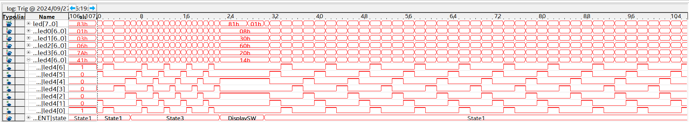
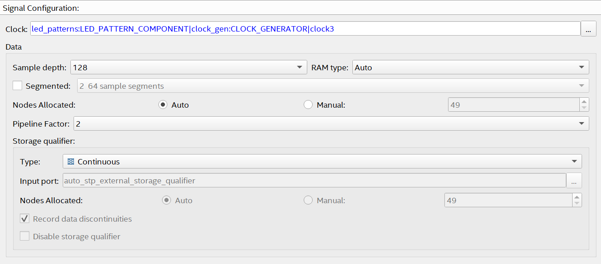

# Lab 5: Signal Tap

## Overview 
For lab 5, the Signal Tap Logic Analyzer tool in Quartus was used to monitor signals in the LED pattern program created in lab 4. The output signal of each pattern generator as well as the actual output driven to the LED was observed alongside the "state" signal of the state machine. The goal was to become familiar with the Signal Tap tool and how it can be used for debugging in the future.

## Deliverables

### Questions

>How much FPGA on-chip memory was required to monitor your signals?

Signal Tap took 6272 bits of memory to monitor the signals for this lab.