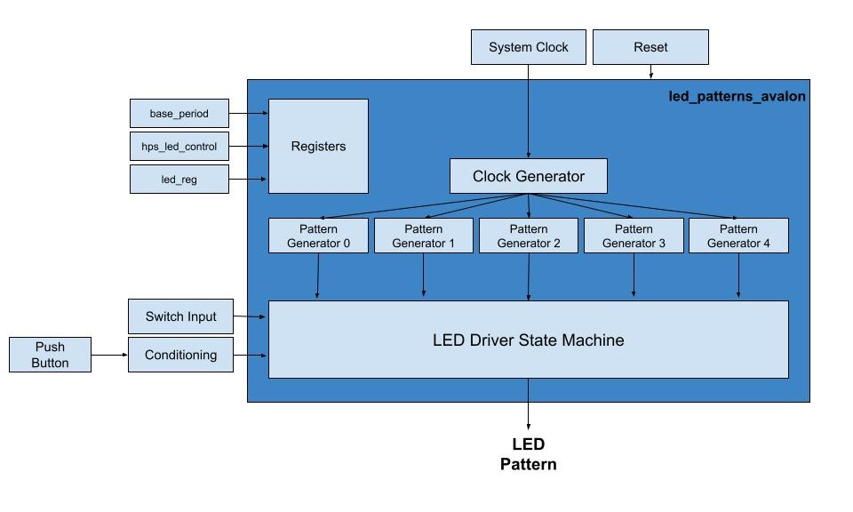
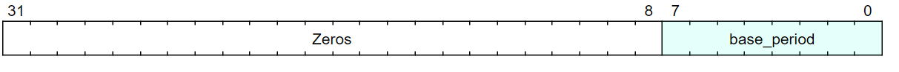
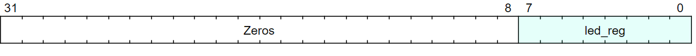
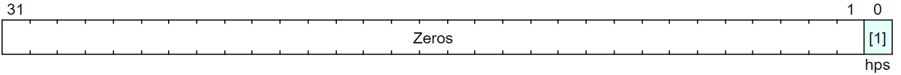
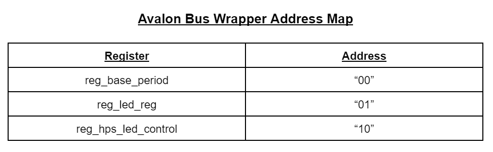
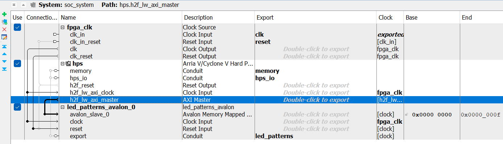

# Lab 6: Custom Hardware Component in Platform Designer

## System Architecture
The hdl of the system did not change much from Lab 4, but an avalon bus wrapper was added to define registers for future use. An updated block diagram including the led_patterns_avalong component can be seen below. The Platform Designer tool was used to create this componenet and map all of the existing signals to the wrapper. Registers for the hps_led_control, led_reg, and base_period signals were created so that we can use software to read and write to these signals in the upcoming labs. 

## Register Map
Three registers were created in the Avalon Bus Wrapper to communicate with the led_patterns component via softtware. The bit field diagrams for these registers can be found below. All three registers are 32 bits in length, but the bits that actually contain the signal varies. The base_period and led_reg registers store the signal in the 8 least significant bits. The hps_led_control register stores the signal in only the first bit, as this signal is a boolean type. The address map is provided below as well, showing which register is associated with each address. On the rising edge of the clock, if the avs_read signal is asserted then the register associated with the current address is read into an avs_readdata register. If the avs_write signal is asserted, the data in the avs_writedata register will be place into the register associated with the current address on the rising edge of the clock.

>base_period Register

>led_reg Register

>hps_led_control Register

>Address Map

## Platform Designer
The Platform Designer tool was used to connect the led_patterns_avalon component to the ARM CPUs in HPS. The figure below shows the Platform Designer window with the connections between each component. An Avalon Memory Mapped Slave interface was included in the creation of the led_patterns_avalon component and this interface was connected to the AXI Master in the HPS. The base address for the avalon component is 0x0000 0000. This can be seen on the right side of the figure below.

